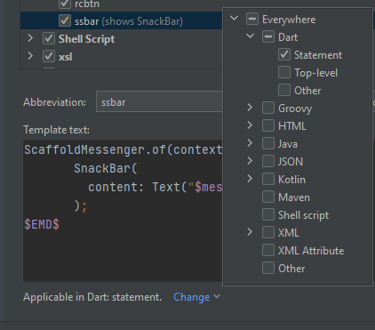

# Create LiveTemplate

------

## Local LiveTemplate
Live-template is a time saving development process. 
I'm going to show you how you can create your won custom live templates.

if you are on android-studio or IntelliJ , follow along   
goto top left corner

``  File > settings > Editors > Live Templates`` 

  

then

#### Let's create our group from left corner and give a name 

#### click on our group and then ``+`` sing again now choose ``live template``

im creating snackBar here,
 - ``Abbreviation`` short form of this code that brings the `Template text`
 - ``Description`` details of the template
 - ``$END$`` is a reserved keyword where our cursor will end. another one is `Statement` & used for wrap with snippets. 
 - bottom ``Statement`` we define the places.

   - 

 - ``Shorten FQ names`` used for shorting libraries name(this example doesn't count), check on Timer template
 

-  a variable name must be start & end with  ``$`` like `$variable$`, 
    
 - ``Edit variables`` control variable names
   
    - 
    
### our ``ssbar`` is complete, save by clicking ``OK`` 

#### we can find it here 

simply type ``ssbar``, it will show our custom live template 

press ``enter/tab``

if we have more variables press ``tab`` to move next variable. 

## check [CustomTemplate.md](CustomTemplate.md) 

------------
## Getting Started

This project is a starting point for a Flutter application.

A few resources to get you started if this is your first Flutter project:

- [Lab: Write your first Flutter app](https://flutter.dev/docs/get-started/codelab)
- [Cookbook: Useful Flutter samples](https://flutter.dev/docs/cookbook)

For help getting started with Flutter, view our
[online documentation](https://flutter.dev/docs), which offers tutorials,
samples, guidance on mobile development, and a full API reference.
